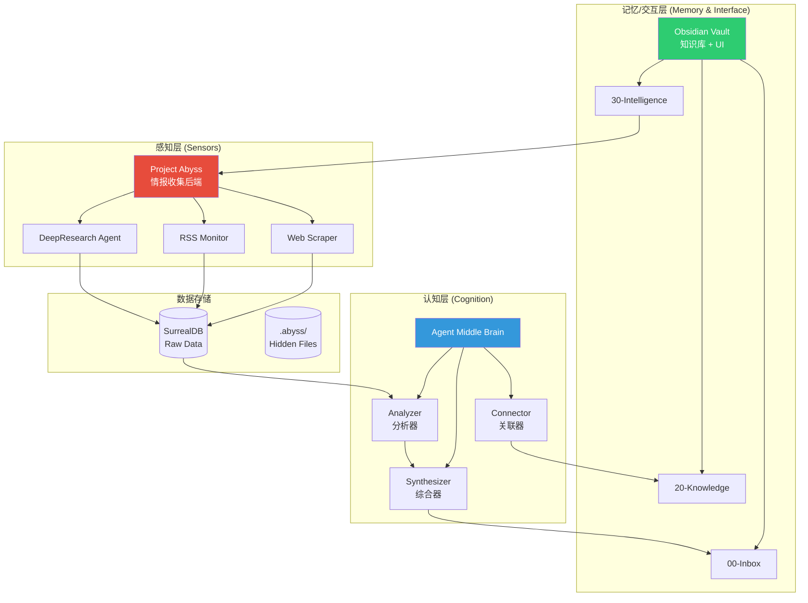
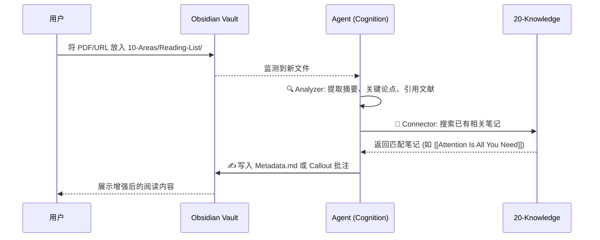
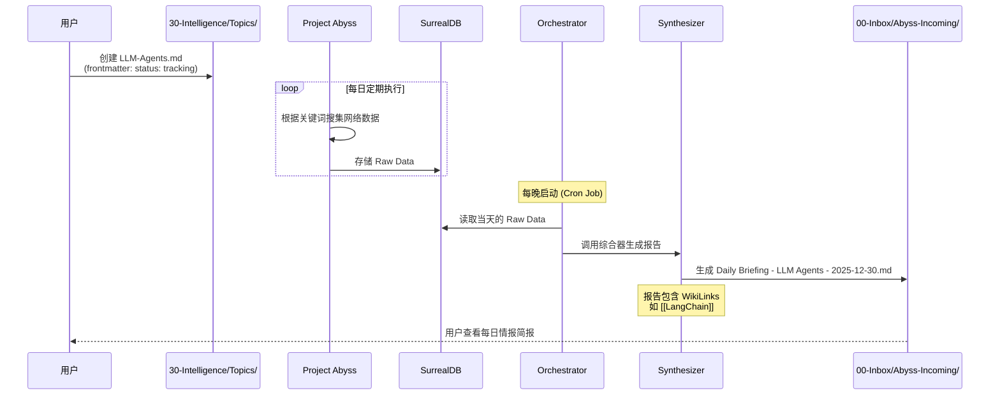
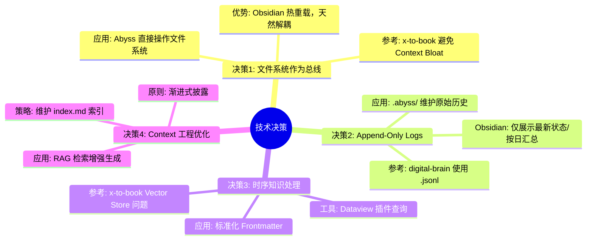
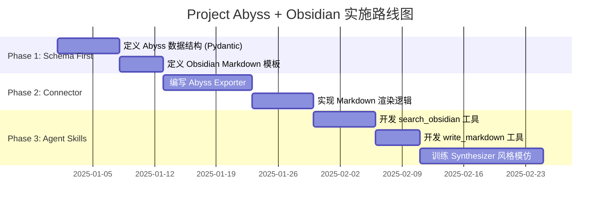
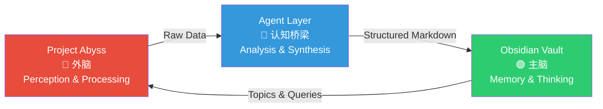

# Project Abyss 架构设计文档

> **核心理念**: 将 Obsidian 作为 **"人类-AI 协同工作的共享内存（Shared Memory）"**，结合 Project Abyss 的情报收集能力，构建个人知识操作系统。

---

## 一、参考项目分析：Agent Skills for Context Engineering

### 1.1 项目概述

该项目 **Agent Skills for Context Engineering** 是一个全面、开放的 Agent Skills（智能体技能）集合，专注于 **上下文工程 (Context Engineering)** 原则，旨在帮助开发者构建生产级的 AI Agent 系统。

### 1.2 核心功能与理念

| 维度 | 说明 |
|------|------|
| **上下文工程 vs. 提示词工程** | 超越传统的提示词工程，专注于从整体上管理和优化语言模型的 **上下文窗口 (Context Window)**。包括精细化管理系统提示词、工具定义、检索文档、对话历史以及工具输出等所有输入信息。 |
| **解决核心痛点** | 解决上下文过长导致的常见问题：如"中间迷失 (lost-in-the-middle)"现象、注意力稀缺以及上下文退化。 |
| **渐进式披露** | 按需加载内容，节省 Token。 |
| **平台无关性** | 适用于 Claude Code, Cursor, Codex 等多种 Agent 平台。 |

---

### 1.3 Skills 概览表

根据 `skills` 目录下的子项目内容，以下是整理出的技能列表：

| Skill Name | 类别 | 核心功能描述 |
|:-----------|:-----|:-------------|
| **context-fundamentals** | Foundational (基础) | 理解什么是上下文、为什么它至关重要，以及在 Agent 系统中上下文的解剖结构。 |
| **context-degradation** | Foundational (基础) | 识别上下文失效的模式：中间丢失、中毒、干扰和冲突。 |
| **context-compression** | Foundational (基础) | 设计和评估针对长期运行会话的上下文压缩策略。 |
| **multi-agent-patterns** | Architectural (架构) | 掌握 Orchestrator、Peer-to-Peer 和 Hierarchical 等多 Agent 架构设计。 |
| **memory-systems** | Architectural (架构) | 设计短期、长期以及基于图的记忆架构。 |
| **tool-design** | Architectural (架构) | 构建 Agent 能够理解并有效调用的工具。 |
| **context-optimization** | Operational (运维) | 应用紧凑化、掩码和缓存等策略优化上下文效率。 |
| **evaluation** | Operational (运维) | 构建用于衡量 Agent 系统表现的评估框架。 |
| **advanced-evaluation** | Operational (运维) | 掌握 "LLM-as-a-Judge" 技术，包括直接打分、成对比较等。 |
| **project-development** | Methodology (方法论) | 从构思到部署的全流程指导，包括任务-模型匹配分析。 |

---

### 1.4 Examples 目录项目分析

`examples` 目录下包含 4 个完整的系统设计案例，展示如何将上下文工程原则应用于生产级场景：

| 项目目录 | 项目描述 | 核心特性 | 应用技能 |
|:---------|:---------|:---------|:---------|
| **digital-brain-skill** | 个人数字大脑/操作系统，专为创始人/创作者设计的个人知识管理系统。 | • 渐进式披露<br>• Append-Only 记忆 (JSONL)<br>• 模块化隔离<br>• 自动化脚本 | context-fundamentals, memory-systems, tool-design, context-optimization, multi-agent-patterns, evaluation, project-development |
| **x-to-book-system** | X (Twitter) 数据生成书籍系统，解决高并发数据和长文本生成问题。 | • Orchestrator 模式<br>• 严格上下文预算<br>• 时序知识图谱<br>• 观测掩码 | multi-agent-patterns, context-fundamentals, memory-systems, context-optimization, tool-design, evaluation |
| **llm-as-judge-skills** | 基于最新研究构建的生产级 LLM 评估工具集。 | • 直接评分<br>• 成对比较<br>• Rubric 生成<br>• EvaluatorAgent | advanced-evaluation, context-fundamentals, tool-design, evaluation |
| **book-sft-pipeline** | 训练小模型模仿特定作者风格的完整流水线。 | • 分段管道架构<br>• 智能分段策略<br>• 多样化提示词<br>• 场景化测试 | project-development, context-compression, multi-agent-patterns, evaluation, context-fundamentals |

---

## 二、架构设计：三层架构 (Three-Tier Architecture)

### 2.1 顶层架构概览

将 Obsidian（知识管理与阅读界面）与 Project Abyss（情报收集后端）结合，从 **系统设计（System Design）**、**数据流转（Data Flow）** 和 **上下文工程（Context Engineering）** 三个维度进行系统性设计。



### 2.2 各层职责详解

#### 🔴 感知层 (Sensors) - Project Abyss

| 属性 | 说明 |
|------|------|
| **角色** | 类似于 x-to-book 中的 Scraper Agent |
| **职责** | 负责"脏活累活"：监控 Web、RSS、社交媒体，执行 DeepResearch |
| **关键设计** | **Observation Masking (观测掩码)**：抓取的海量 HTML/JSON **绝不直接进入** Obsidian 或 Agent Context |
| **输出** | 结构化的原始数据（Raw Data），存入 SurrealDB 或 `.abyss/raw_data/` |

#### 🔵 认知层 (Cognition) - The Agent "Middle Brain"

| 属性 | 说明 |
|------|------|
| **角色** | 类似于 x-to-book 中的 Analyzer & Synthesizer，以及 digital-brain 中的 Automation Scripts |
| **职责** | "阅读"感知层的数据，结合 Obsidian 中已有的知识，生成新的洞察 |
| **ETL Pipeline** | 定期（或事件驱动）从 Raw Data 中提取信息 |
| **Context Retrieval** | 在生成报告前，先检索 Obsidian 中的相关笔记（避免重复，建立连接） |

#### 🟢 记忆/交互层 (Memory & Interface) - Obsidian Vault

| 属性 | 说明 |
|------|------|
| **角色** | 既是数据库，也是 UI |
| **职责** | 人类与 AI 的交互界面 |
| **Digital Brain Structure** | 采用严格的目录结构，让 AI 知道去哪里写什么 |
| **Markdown as API** | 所有最终产出必须是格式优美的 Markdown |

---

## 三、详细设计方案

### 3.1 目录结构契约 (Directory Contract)

参考 digital-brain-skill 的模块化设计，在 Obsidian 中建立明确的"契约"：

```text
Obsidian Vault Root/
├── 00-Inbox/
│   └── Abyss-Incoming/      # [Abyss] 每天的简报/新搜集的情报
├── 10-Areas/
│   └── Reading-List/        # [Human] 用户放入的待读文章/PDF
├── 20-Knowledge/            # [Human + AI] 核心知识库 (Digital Brain)
├── 30-Intelligence/         # [Abyss] 长期追踪的主题
│   ├── Entities/            # 追踪的人/组织
│   └── Topics/              # 追踪的话题 (如 "AI Agents", "LLM Evaluation")
├── 90-System/
│   ├── Prompts/             # 存放系统的 System Prompts
│   └── Logs/                # Agent 运行日志
└── .abyss/                  # [Hidden] 原始数据，不直接在 Obsidian 显示
```

---

### 3.2 核心工作流设计 (Core Workflows)

#### 场景 A：智能阅读流 (Enhanced Reader)



**流程说明**：
1. **用户行为**：将一篇长论文 PDF 或 URL 丢入 `10-Areas/Reading-List/`
2. **Agent 行为**：
   - 监测到新文件
   - **分析 (Analyzer)**：提取摘要、关键论点、引用文献
   - **连接 (Connector)**：搜索 `20-Knowledge/` 中已有的相关笔记
   - **写入**：在文件旁生成 `Metadata.md` 或直接在原文做 callout 批注

---

#### 场景 B：情报转化流 (Abyss -> X-to-Book Logic)



**流程说明**：
1. **用户行为**：在 `30-Intelligence/Topics/` 建立文件 `LLM-Agents.md`，Frontmatter 标记 `status: tracking`
2. **Project Abyss**：
   - 后台定期根据关键词在网络搜集数据
   - Scraper 存入 raw data
3. **Orchestrator (X-to-Book 模式)**：每晚启动，读取当天的 raw data
4. **Synthesizer**：生成 `Daily Briefing - LLM Agents - 2025-12-30.md` 放入 `00-Inbox/Abyss-Incoming/`
5. **关键点**：生成的报告必须包含 **WikiLinks**（如 `[[LangChain]]`），通过双链自动连接知识库

---

### 3.3 关键技术决策 (Technical Decisions)



#### 决策 1：文件系统作为总线 (File System as Bus)

| 维度 | 说明 |
|------|------|
| **参考** | x-to-book 为了避免 Context Bloat，让各级 Agent 通过文件系统交换状态 |
| **应用** | Abyss 不直接调用 Obsidian API (插件接口可能不稳定)，而是直接操作文件系统（Markdown 文件） |
| **优势** | Obsidian 能够实时热重载文件变更，天然解耦后端与前端 |

#### 决策 2：Append-Only Logs vs. Validated State

| 维度 | 说明 |
|------|------|
| **参考** | digital-brain 使用 `.jsonl` 记录日志，`.md` 展示状态 |
| **应用** | 情报收集历史在 `.abyss/` 目录下维护 `.jsonl` (raw history)，Obsidian 可见目录仅维护"最新状态"或"按日汇总" |
| **目的** | 避免 Obsidian 变成垃圾场 |

#### 决策 3：时序知识的处理

| 维度 | 说明 |
|------|------|
| **参考** | x-to-book 提到 Vector Store 丢失时间维度的问题 |
| **应用** | 利用 **Dataview 插件** 格式，Agent 写入数据时包含标准化 Frontmatter |

**Frontmatter 规范示例**：

```yaml
---
type: intelligence-report
topic: "[[LLM-Agents]]"
source: Abyss
date: 2025-12-30
sentiment: Positive
key_entities:
  - OpenAI
  - DeepMind
---
```

#### 决策 4：Context 工程优化

| 维度 | 说明 |
|------|------|
| **问题** | Agent 不能读取整个 Vault |
| **方案 A** | 实现 RAG (检索增强生成) 模块 |
| **方案 B** | 维护 `index.md` (Map of Contents)，Agent 先读索引，再按需读取子文件 |
| **原则** | 渐进式披露 (Progressive Disclosure) |

---

## 四、实施路线图 (Next Steps)



### 4.1 Phase 1: 定义数据结构 (Schema First)

- [ ] 确定 Abyss 抓取的数据结构（Python Pydantic Models）
- [ ] 确定 Obsidian 里的 Markdown 模板（Frontmatter 规范）

### 4.2 Phase 2: 构建 Abyss 连接器

- [ ] 在 project-abyss 中编写 `Exporter`
- [ ] 负责将结构化数据渲染成符合规范的 Markdown 文件
- [ ] 写入 Obsidian 目录

### 4.3 Phase 3: 开发核心 Agent 技能

- [ ] **Researcher Skill**：基于 tool-design，给 Agent 配备 `search_obsidian` 和 `write_markdown` 工具
- [ ] **Synthesizer Skill**：训练 Agent 学会你的笔记风格（参考 book-sft-pipeline 里的风格模仿）

---

## 五、总结

> 🧠 这个架构将 **Project Abyss** 变成了你的 **外脑（Perception & Processing）**，而 **Obsidian** 依旧是你的 **主脑（Memory & Thinking）**，两者通过 Agent 和 Markdown 完美耦合。

